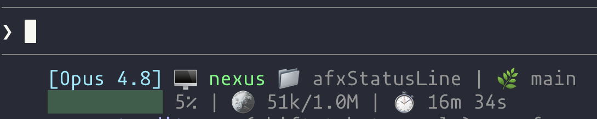

# afxStatusLine

A clean, two-line [Claude Code](https://claude.com/claude-code) status line that shows your model, machine, directory, git branch, a color-coded context-window bar, token usage, and session elapsed time.



```
[Opus] 🖥️ nexus 📁 my-app | 🌿 main
████░░░░░░ 42% | 🪙 84k/200k | ⏱️ 7m 3s
```

- **Line 1** — `[Model] 🖥️ host 📁 dir | 🌿 branch`
- **Line 2** — `<context bar> NN% | 🪙 used/total tokens | ⏱️ elapsed`

The context bar is color-coded by how full the context window is:

| Usage   | Color  |
|---------|--------|
| < 70%   | green  |
| 70–89%  | yellow |
| ≥ 90%   | red    |

The 🌿 branch segment only appears when the current directory is inside a git repo.

## Preview

| Color    | Used for                                   |
|----------|--------------------------------------------|
| Cyan     | `[Model]`                                   |
| Green    | `🖥️ host`                                    |
| Default  | `📁 dir`, percentages, tokens, time         |
| Bar      | green / yellow / red by context usage       |

## Requirements

- [Claude Code](https://claude.com/claude-code)
- [`jq`](https://jqlang.github.io/jq/) — JSON parsing
  - macOS: `brew install jq`
  - Debian/Ubuntu: `sudo apt-get install jq`
  - Fedora: `sudo dnf install jq`
- `git` (optional — only used to show the current branch)
- A terminal/font with emoji support

## Install

1. **Copy the script** into your Claude Code config directory:

   ```bash
   cp statusline.sh ~/.claude/statusline.sh
   chmod +x ~/.claude/statusline.sh
   ```

   Or run the installer, which copies the script and merges the settings for you:

   ```bash
   ./install.sh
   ```

2. **Register it** in `~/.claude/settings.json`. Add this top-level key (merge it into your existing settings — don't overwrite the file):

   ```json
   "statusLine": {
     "type": "command",
     "command": "~/.claude/statusline.sh",
     "padding": 2,
     "refreshInterval": 1
   }
   ```

   See [`settings.example.json`](settings.example.json) for a complete minimal example.

3. **Restart Claude Code** (or start a new session) so it picks up the new setting.

## Configuration

### Machine label

The `🖥️` label is hardcoded near the top of the script so it's stable across directories and git repos. Change it to your machine name:

```bash
HOST="nexus"   # <-- edit this
```

If you'd rather show the real hostname, replace it with:

```bash
HOST="$(hostname -s)"
```

### Colors

ANSI colors are defined together near the top of the script:

```bash
CYAN='\033[36m'; GREEN='\033[32m'; YELLOW='\033[33m'; RED='\033[31m'; MAGENTA='\033[35m';
```

Swap the variables used in the final two `echo` lines to recolor any segment. For example, to make the host magenta instead of green, change `${GREEN}🖥️` to `${MAGENTA}🖥️`.

## How it works

Claude Code invokes the status-line command on each refresh and pipes a JSON blob to it on stdin. The script reads that with `jq` and prints (at most) two lines to stdout, which Claude Code renders verbatim. The fields used:

| JSON path                                  | Used for                  |
|--------------------------------------------|---------------------------|
| `.model.display_name`                      | model name                |
| `.workspace.current_dir`                   | current directory         |
| `.context_window.used_percentage`          | bar fill + color          |
| `.context_window.total_input_tokens`       | tokens in context         |
| `.context_window.total_output_tokens`      | tokens in context         |
| `.context_window.context_window_size`      | window size               |
| `.cost.total_duration_ms`                  | elapsed time              |

## Test it

You can exercise the script without Claude Code by piping it mock input:

```bash
echo '{"model":{"display_name":"Opus"},"workspace":{"current_dir":"/home/user/my-app"},"context_window":{"used_percentage":42,"total_input_tokens":83000,"total_output_tokens":1000,"context_window_size":200000},"cost":{"total_duration_ms":423000}}' | ./statusline.sh
```

Expected:

```
[Opus] 🖥️ nexus 📁 my-app
████░░░░░░ 42% | 🪙 84k/200k | ⏱️ 7m 3s
```

## Build prompt

This status line was built by Claude Code from a single prompt. The exact prompt is preserved in [`PROMPT.md`](PROMPT.md) so you can reproduce, audit, or remix it.

## License

[MIT](LICENSE)
